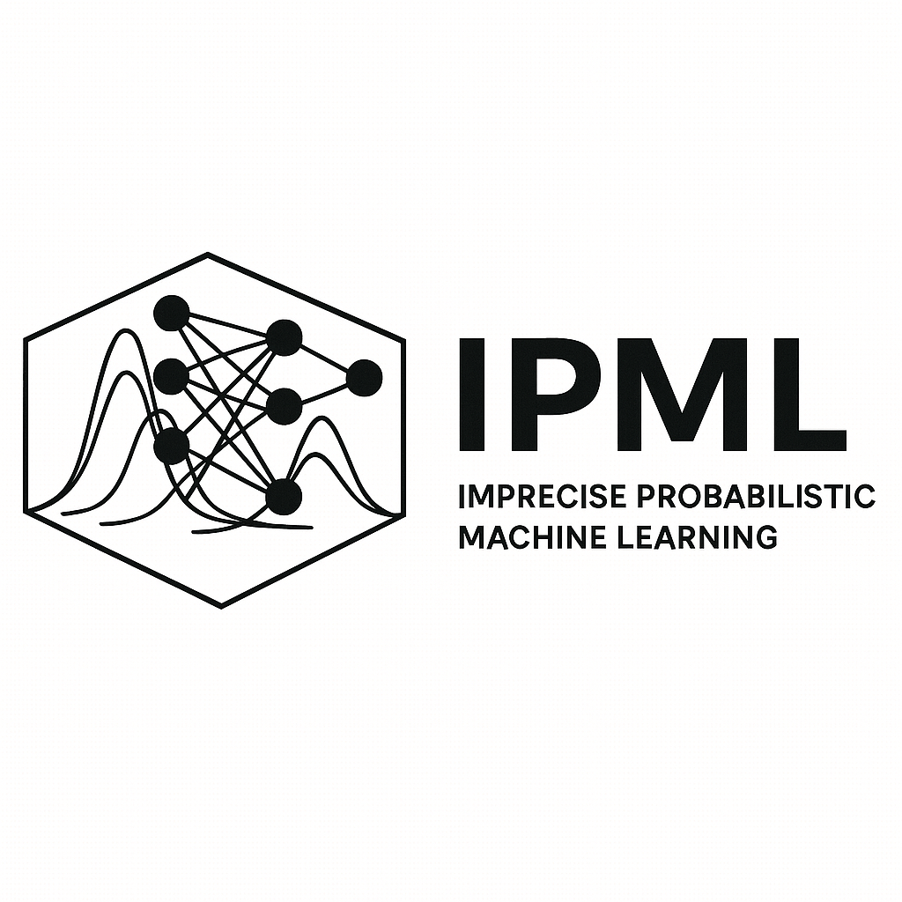

# Imprecise Probabilistic Machine Learning

 
> “There are known knowns. There are known unknowns. But there are also unknown unknowns—things we do not yet realize we do not know.”—Donald Rumsfeld (2002)

 

While modern machine learning (ML) algorithms have made significant progress, most are built on classical probability theory and associated decision theory. This framework often struggles to capture the multifaceted uncertainties inherent in complex, real-world systems, which can negatively impact the robustness, trustworthiness, and safety of deployed models. Imprecise probability (IP) provides a more flexible and faithful approach to representing and manipulating uncertainty. By relaxing the additivity axiom, which is a foundational rule in Kolmogorov’s classical probability theory, we can create more flexible models for quantifying uncertainty. These models, which go beyond standard probability measures, include concepts like capacities, lower and upper previsions, and belief functions, along with possibility and necessity measures. Imprecise Probabilistic Machine Learning (IPML) is a growing area of research dedicated to developing ML models that leverage IP theory to achieve greater robustness, trustworthiness, and safety.

In this course, students will learn the theoretical foundations of imprecise probability (IP), its ability to capture the complex uncertainties in real-world systems, and its practical applications in machine learning. The course will explore the field's breadth, from philosophical debates surrounding the nature and interpretation of probability to cutting-edge applications in areas such as classification, regression, conformal prediction, reinforcement learning, causal inference, and foundation models. In addition, students will gain hands-on experience implementing simple IPML algorithms to solve problems in different application areas.

This course covers four main topics:
1. **Foundation of Imprecise Probability**: Learn the core principles behind this powerful theory.
2. **Imprecise Probabilistic Machine Learning (IPML)**: Discover how to integrate IP into machine learning models.
3. **IPML in Modern AI**: Explore its application in cutting-edge fields like deep learning, foundation models, large language models (LLMs), and generative AI (GenAI).
4. **Applications for Trustworthy AI**: Understand how IPML can be used to improve fairness, privacy, ethics, and safety in AI systems.

Throughout the course, students will solidify their understanding by completing a combination of written and coding exercises. This hands-on approach allows them to implement and evaluate the techniques they learn.

## Outline of the Course
This course is divided into two main parts.

**`Part 1`** establishes the foundational concepts of imprecise probability (IP). We will look at various IP models, exploring their intuitive motivations and technical underpinnings. The core focus will be on possibility measures, random sets, belief functions, and lower/upper previsions. This section concludes with an examination of key decision-making criteria tailored for imprecise probability models.

**`Part 2`** explores the practical applications of imprecise probability in machine learning. Topics covered will include its use in classification, regression, conformal prediction, and uncertainty quantification, as well as its relevance to reinforcement learning, causal inference, and foundation models. Students will also learn to implement fundamental imprecise probability algorithms for these diverse applications. 
A course project, detailed below, allows students to further tailor the material to their specific interests.

### Part I: Foundation of Imprecise Probability

- **`Lecture 1: Introduction`** introduces the fundamentals of statistical machine learning, emphasising the ultimate goal of learning from data. We will explore how uncertainty arises in machine learning—through data, models, and environments—and why managing it is central to effective learning. Core paradigms such as classification, regression, unsupervised, semi-supervised, self-supervised, and reinforcement learning will be discussed alongside Bayesian methods and generative modeling. Finally, we examine the limitations of current approaches in terms of generalization, robustness, trustworthiness, and safety, and show how these challenges are deeply rooted in probability theory.

   <em>Lecture notes: [Slides](lecture-01/lecture-01-introduction.pdf)</em>

   <em>Recommended reading:</em> TBA

- **`Lecture 2: Overview of Imprecise Probability`** introduces different ways of understanding and representing uncertainty. We begin by asking what uncertainty is and how probability is used to model it, before exploring key interpretations of probability and their implications for machine learning. We then discuss categories of uncertainty, such as aleatoric and epistemic, and examine the limits of traditional probability theory. Finally, we look at the game-theoretic approach to uncertainty and introduce lower and upper previsions as a more flexible framework for reasoning under uncertainty.

   <em>Lecture notes: [Slides](lecture-02/lecture-02-overview-of-imprecise-probability.pdf)</em>

   <em>Recommended reading:</em>
   - [Imprecise Probabilities - Stanford Encyclopedia of Philosophy](https://plato.stanford.edu/entries/imprecise-probabilities/)
   - [Interpretations of Probability - Stanford Encyclopedia of Philosophy](https://plato.stanford.edu/entries/probability-interpret/)
  
- **`Lecture 3: Possibility Theory`** introduces possibility theory, a close relative of probability theory rooted in the theory of belief functions. We will explore how it differs from probability through concepts such as basic belief assignments, possibility and necessity values, and their interpretations. The lecture covers key perspectives on possibility theory—from the theory of surprise to flexible linguistic constraints, comparative possibility, and Baconian probabilities. We will also examine special cases of possibility distributions, their links to imprecise probability models, and how they support reasoning and decision-making. Finally, we discuss when possibility theory is needed, particularly in machine learning, and how to learn possibility models from data or expert input using principles like minimal specificity and conjunctive combination.

      <em>Lecture notes: [Slides](lecture-03/lecture-03-possibility-theory.pdf)</em>

  
- **`Lecture 4: Belief Function Theory`** introduces belief function theory, a framework that generalizes both probability and possibility theories. We will cover the concept of basic belief assignments (and their link to cooperative games), belief and plausibility measures, and methods for computing lower and upper expectations, including Choquet integration. Different interpretations of the theory will be discussed, from Dempster’s multi-valued mappings to Shafer’s theory of evidence and Smets’ transferable belief model. We will also explore Dempster’s rule for information fusion and conditioning, the inverse Möbius transformation, and applications of belief functions in machine learning.

   <em>Lecture notes: available after the lecture</em>

- **`Lecture 5: Convex Sets of Probabilities`** explores credal sets—convex sets of probabilities—as a unifying framework for imprecise probability models. We will study examples and characterizations of credal sets, and learn how to compute lower and upper probabilities and expectations through envelope functions. Key topics include marginal and conditional credal sets, robust Bayesian inference, and inference via the Generalised Bayes Rule (GBR). We will also discuss different notions of independence, and conclude with recent advances in credal-set methods for machine learning.

   <em>Lecture notes: available after the lecture</em>

- **`Lecture 6: Decision Making under Imprecision`** How should we make decisions when probabilities are uncertain or incomplete? This lecture begins with a review of classical decision theory and then explores decision-making with imprecise probabilities, supported by real-world examples. We introduce key imprecise decision rules—such as maximality, E-admissibility, Γ-maximin, and interval dominance—and show how they provide more robust choices under ambiguity. Finally, we connect these ideas to modern machine learning, where imprecise decision-making plays an important role in building safer and more trustworthy AI systems.

   <em>Lecture notes: available after the lecture</em>

### Part II:  Imprecise Probability in Machine Learning

- **`Lecture 7: Imprecise Classification and Regression`** explores how imprecise probability can improve classification and regression in machine learning. We discuss why standard models often fall short—showing overconfidence, vulnerability to adversarial examples, and lack of robustness—and how imprecise probability offers a principled way to address these issues. Finally, we look at concrete examples of machine learning models that have been extended with imprecise probability to make their predictions more reliable.

   <em>Lecture notes: available after the lecture</em>

- **`Lecture 8: Uncertainty Quantification`** introduces uncertainty quantification in machine learning. We discuss why it matters, how to distinguish and measure different types of uncertainty (aleatoric, epistemic, and total), and what properties good measures should have. We then examine common approaches, their limitations—especially in capturing epistemic uncertainty—and the challenges of building a universal framework. Finally, we look at practical applications of uncertainty quantification in modern ML.

     <em>Lecture notes: available after the lecture</em>

- **`Lecture 9: Conformal Prediction and Calibration`** introduces conformal prediction, a framework for distribution-free uncertainty quantification that works with almost any machine learning model. We cover the basics of the method, its connections to calibration and imprecise probability, and how these ideas are used to improve the trustworthiness of modern ML systems.

     <em>Lecture notes: available after the lecture</em>

- **`Lecture 10: Deep Learning, Foundation Models, LLM, GenAI`** explores how imprecise probability can be applied to modern machine learning, including deep learning, foundation models, large language models, fine-tuning, and generative AI. We discuss its potential to improve reliability and robustness in these areas, as well as the key challenges of adopting it in large-scale applications.

     <em>Lecture notes: available after the lecture</em>

- **`Lecture 11: Fairness, Privacy, Ethics, Safety, etc`** asks whether imprecise probability can help address key societal concerns at the intersection of AI and society, such as fairness, privacy, ethics, and safety. We will explore important use cases that demonstrate its potential benefits in tackling these challenges.

   <em>Lecture notes: available after the lecture</em>

- **`Lecture 12-13: Project presentation`**

## Course Project

The course project gives students a chance to apply what they've learned to a problem that interests them. After completing Part I, students will form groups of up to two people and choose a real-world problem to solve. Each group will present the final project to the class at the end of Part II.

## Logistic

- Lecture: Friday, 10 a.m. to 12 p.m., Room G-228
- Exercise: Friday, 12 p.m. to 2 p.m., Room G-228
- Location: Room G-228 (in person) and virtually on **[Zoom](https://cispa-de.zoom-x.de/meeting/register/QvE86yQJR3aL4RqRFAIeHg)** (registration required). The off-line discussion on [Piazza](https://piazza.com/cispa.de/fall2025/ipml101) (**Access Code**: 41xb2bk96h3)
- Exam dates:
  + Wednesday, March 18, 2026, 1:30–3:30 p.m. in D-220 (Stellingen)
  + Thursday, March 12, 2026, 9:30-11:30 a.m. in D-220 (Stellingen)

## Course Schedule

- ~~[17 Oct 2025] Lecture 1 + Orientation (in-person)~~
- ~~[24 Oct 2025] Lecture 2 (online)~~
- [31 Oct 2025] No class (holiday in Germany)
- [07 Nov 2025] Lecture 3 (online)
- [14 Nov 2025] Lecture 4 (in-person, hybrid)

## Useful Resources

### Books

- Statistical Reasoning with Imprecise Probabilities (1990) by Peter Walley
- Introduction to Imprecise Probabilities (2014) by Thomas Augustin, Frank P.A. Coolen, Gert de Cooman, and Matthias C. M. Troffaes
- Lower Previsions (2014) by Matthias C. M. Troffaes and Gert de Cooman
- Inferential Models: Reasoning with Uncertainty (2016) by Ryan Martin and Chuanhai Liu
- The Geometry of Uncertainty: The Geometry of Imprecise Probabilities (2021) by Fabio Cuzzolin
- Introduction to Uncertainty Quantification (2015) by T. J. Sullivan
- Probability and Finance: It's Only a Game! (2005) by Glenn Shafer and Vladimir Vovk

### Articles

- [Imprecise Probability](https://plato.stanford.edu/entries/imprecise-probabilities/), The Stanford Encyclopedia of Philosophy, 2019
- [Interpretations of Probability](https://plato.stanford.edu/entries/probability-interpret/), The Stanford Encyclopedia of Philosophy, 2023
- [Epistemic Artificial Intelligence is Essential for Machine Learning Models to Truly ‘Know When They Do Not Know’](https://arxiv.org/pdf/2505.04950)

### Master and PhD Theses
- [Imprecise Probabilities in Machine Learning: Structure and Semantics](https://bibliographie.uni-tuebingen.de/xmlui/bitstream/handle/10900/171001/froehlich_thesis.pdf?sequence=3), Christian Fröhlich, 2025

### Research Papers

#### Foundations and Representations of Imprecise Probability

- [An introduction to the imprecise Dirichlet model for multinomial data](https://www.sciencedirect.com/science/article/pii/S0888613X04001069), International Journal of Approximate Reasoning, 2005
- [Towards a strictly frequentist theory of imprecise probability](https://proceedings.mlr.press/v215/frohlich23a.html), ISIPTA 2023
- [Credal Learning Theory](https://arxiv.org/pdf/2402.00957), NeurIPS 2024
- [Game-Theoretic Statistics and Safe Anytime-Valid Inference](https://arxiv.org/abs/2210.01948), Statistical Science, 2023
- [On Individual Risk](https://arxiv.org/pdf/1406.5540), Synthese, 2017 (Discuss different interpretations of probability)
- [Judicious Judgment Meets Unsettling Updating: Dilation, Sure Loss and Simpson’s Paradox](https://projecteuclid.org/journals/statistical-science/volume-36/issue-2/Judicious-Judgment-Meets-Unsettling-Updating--Dilation-Sure-Loss-and/10.1214/19-STS765.full), Statistical Science, 2021

#### Imprecise Classification and Regression
- [Learning Sets of Probabilities Through Ensemble Methods](https://hal.science/hal-04371410/file/Learning_Sets_of_Probabilities_Through_Ensemble_Methods-2.pdf), ECSQARU 2023
- [Possibilistic Classification by Support Vector Networks](https://www.sciencedirect.com/science/article/abs/pii/S0893608022000405?via%3Dihub), Neural Networks, 2022
- [Neural Network Model for Imprecise Regression with Interval Dependent Variables](https://arxiv.org/pdf/2206.02467), Neural Networks, 2023
- [Possibilistic Instance-based Learning](https://www.sciencedirect.com/science/article/pii/S0004370203000195), Artificial Intelligence, 2003
- [Reliable Classification: Learning Classifiers that Distinguish Aleatoric and Epistemic Uncertainty](https://www.mathematik.uni-marburg.de/~eyke/publications/reliable-classification.pdf), Information Sciences, 2014
- [Reliable Multi-class Classification based on Pairwise Epistemic and Aleatoric Uncertainty](https://www.ijcai.org/proceedings/2018/0706.pdf), IJCAI, 2018
- [Weakly-Supervised Contrastive Learning for Imprecise Class Labels](https://arxiv.org/abs/2505.22028), ICML, 2025
- [Imprecise Label Learning: A Unified Framework for Learning with Various Imprecise Label Configurations](https://arxiv.org/pdf/2305.12715), NeurIPS 2024
- [Credal Wrapper of Model Averaging for Uncertainty Estimation in Classification](https://arxiv.org/abs/2405.15047), ICLR, 2025
- [Credal Prediction based on Relative Likelihood](https://arxiv.org/pdf/2505.22332), NeurIPS 2025

#### Conformal Prediction
- [A Tutorial on Conformal Prediction](https://jmlr.csail.mit.edu/papers/volume9/shafer08a/shafer08a.pdf), JMLR, 2008
- [A Gentle Introduction to Conformal Prediction and Distribution-Free Uncertainty Quantification](https://arxiv.org/abs/2107.07511), ArXiv, 2022
- [Conformalized Credal Set Predictors](https://arxiv.org/pdf/2402.10723), NeurIPS, 2024
- [A Gentle Introduction to Conformal Prediction and Distribution-Free Uncertainty Quantification](https://arxiv.org/pdf/2107.07511), ArXiv, 2022
- [Conformal Prediction Regions are Imprecise Highest Density Regions](https://arxiv.org/pdf/2502.06331), ArXiv, 2025
- [Conformal Prediction with Partially Labeled Data](https://proceedings.mlr.press/v204/javanmardi23a/javanmardi23a.pdf), ArXiv, 2023
- [Learning Calibrated Belief Functions from Conformal Predictions](https://proceedings.mlr.press/v215/martin-bordini23a/martin-bordini23a.pdf), ISIPTA, 2023
- [Validity, Consonant Plausibility Measures, and Conformal Prediction](https://arxiv.org/pdf/2001.09225), International Journal of Approximate Reasoning, 2022
- [The Joys of Categorical Conformal Prediction](https://arxiv.org/abs/2507.04441), ArXiv 2025

#### Out-of-Distribution Generalisation
- [Domain Generalisation via Imprecise Learning](https://arxiv.org/abs/2404.04669), ICML 2024

#### Statistical Inference
- [Credal Two-sample Tests of Epistemic Uncertainty](https://arxiv.org/pdf/2410.12921), AISTATS 2025
- [Integral Imprecise Probability Metrics](https://arxiv.org/abs/2505.16156), NeurIPS 2025
- [False Confidence, Non-additive Beliefs, and Valid Statistical Inference](https://arxiv.org/pdf/1607.05051), IJAR 2019

#### Causality and Causal Inference
- [Credal networks](https://www.sciencedirect.com/science/article/pii/S0004370200000291), Artificial Intelligence, 2000
- [Thirty years of credal networks: Specification, algorithms and complexity](https://www.sciencedirect.com/science/article/pii/S0888613X20302152), International Journal of Approximate Reasoning, 2020

#### Uncertainty Quantification
- [Quantifying Aleatoric and Epistemic Uncertainty in Machine Learning: Are Conditional Entropy and Mutual Information Appropriate Measures?](https://arxiv.org/abs/2209.03302), UAI, 2023
- [Aleatoric and Epistemic Uncertainty in Machine Learning: An Introduction to Concepts and Methods](https://arxiv.org/pdf/1910.09457), Machine Learning, 2021
- [Is the Volume of a Credal Set a Good Measure for Epistemic Uncertainty?](https://arxiv.org/pdf/2306.09586) UAI, 2023
- [Pitfalls of Epistemic Uncertainty Quantification through Loss Minimisation](https://arxiv.org/pdf/2203.06102), NeurIPS, 2022
- [Quantification of Credal Uncertainty in Machine Learning: A Critical Analysis and Empirical Comparison](https://proceedings.mlr.press/v180/hullermeier22a/hullermeier22a.pdf), UAI, 2022
- [Uncertainty Measures: A Critical Survey](https://www.sciencedirect.com/science/article/abs/pii/S1566253524003877), Information Fusion, 2024
- [Second-order Uncertainty Quantification: A Distance-based Approach](https://arxiv.org/abs/2312.00995), ICML, 2022

#### Imprecise Probabilistic Forecast and Calibration
- [IP Scoring Rules: Foundations and Applications](https://proceedings.mlr.press/v103/konek19a.html), ISIPTA, 2019
- [Evaluating Imprecise Forecasts](https://proceedings.mlr.press/v215/konek23a/konek23a.pdf), ISIPTA, 2023
- [IP Scoring Rules: Foundations and Applications](https://proceedings.mlr.press/v103/konek19a/konek19a.pdf), ISIPTA, 2019
- [On Second-Order Scoring Rules for Epistemic Uncertainty Quantification](https://arxiv.org/pdf/2301.12736), ICML, 2023
- [Truthful Elicitation of Imprecise Forecasts](https://arxiv.org/pdf/2503.16395), UAI, 2025
- [On the Calibration of Probabilistic Classifier Sets](https://proceedings.mlr.press/v206/mortier23a/mortier23a.pdf), AISTATS, 2023
- [Scoring Rules and Calibration for Imprecise Probabilities](https://arxiv.org/pdf/2410.23001), ArXiv, 2024

#### Decision-Making with Imprecise Probability
- [Decision Making under Uncertainty using Imprecise Probabilities](https://arxiv.org/pdf/1807.03705), International Journal of Approximate Reasoning, 2007
- [Archimedean Choice Functions: An Axiomatic Foundation for Imprecise Decision Making](https://arxiv.org/pdf/2002.05196), Information Processing and Management of Uncertainty in Knowledge-Based Systems, 2020
- [Risk Measures and Upper Probabilities: Coherence and Stratification](https://www.jmlr.org/papers/volume25/22-0641/22-0641.pdf), JMLR 2024
- [Concepts for Decision Making under Severe Uncertainty with Partial Ordinal and Partial Cardinal Preferences](https://proceedings.mlr.press/v62/jansen17a/jansen17a.pdf), ISIPTA 2017

#### Imprecise Probability in Modern ML (Deep Learning, Foundation Models, LLM, GenAI)
- [Credal Bayesian Deep Learning](https://arxiv.org/pdf/2302.09656), TMLR, 2024
- [Aleatoric and Epistemic Uncertainty with Random Forests](https://arxiv.org/pdf/2001.00893), Advances in Intelligent Data Analysis, 2020
- [Credal Self-Supervised Learning](https://arxiv.org/pdf/2106.11853), NeurIPS, 2021
- [Imprecise Bayesian optimization](https://www.sciencedirect.com/science/article/pii/S0950705124008207), Knowledge-Based Systems, 2024
- [Random-Set Large Language Models](https://arxiv.org/abs/2504.18085), ArXiv 2025
- [Abductive Reasoning in Logical Credal Networks](https://proceedings.neurips.cc/paper_files/paper/2024/file/7d7020e945935214d756cd9a65c43170-Paper-Conference.pdf), NeurIPS, 2024
- [Credal Deep Ensembles for Uncertainty Quantification](https://proceedings.neurips.cc/paper_files/paper/2024/hash/911fc798523e7d4c2e9587129fcf88fc-Abstract-Conference.html), NeurIPS, 2024

#### Use Cases of Imprecise Probability in Fairness, Privacy, Ethics, Safety, etc
- [Differential privacy: general inferential limits via intervals of measures](https://proceedings.mlr.press/v215/bailie23a.html), ISIPTA, 2023
- [Statistical Comparisons of Classifiers by Generalized Stochastic Dominance](https://www.jmlr.org/papers/volume24/22-0902/22-0902.pdf), JMLR, 2023
- [Distributionally Robust Statistical Verification with Imprecise Neural Networks](https://arxiv.org/pdf/2308.14815), HSCC, 2024
- [Imprecise Probability for Non-commuting Observables](https://iopscience.iop.org/article/10.1088/1367-2630/17/8/085005), New Journal of Physics, 2015

### Related Courses

The teaching materials for this course were partly inspired by those used in the following courses: 

- [ST790: Imprecise-Probabilistic Foundations of Statistics & Data Science](https://wordpress-courses2223.wolfware.ncsu.edu/st-790-001-fall-2022/) by [Ryan Martin](https://www4.stat.ncsu.edu/~rgmarti3/)
- [Uncertainty Representation and Reasoning (2AMU30)](https://dai.win.tue.nl/courses/2AMU30/) by Erik Quaeghebeur and Vu-Linh Nguyen 

### Scientific events

- [The Society for Imprecise Probabilities: Theories and Applications (SIPTA)](https://sipta.org/)
- [SIPTA School](https://sipta.org/events/sipta-school/)
- [The 1st Workshop on Epistemic Intelligence in Machine Learning (EIML)](https://sites.google.com/view/eiml-eurips2025/) at [EurIPS 2025](https://eurips.cc/)

